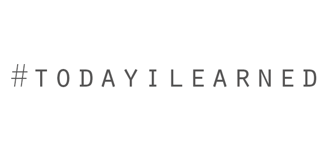

# Today I learned 👨🏻‍💻

This repo is a collection of concise write-ups on small things I learn day-to-day across a variety of languages and technologies. These are things that don't really warrant a full blog post. These are things I've picked up by Learning In Public™ and pairing with smart people.

This repo was aptly named TIL \(Today I Learned\). I say aptly because I added to it, nearly daily, the small things I picked up from others and from my own googling, reading, and experimenting.

